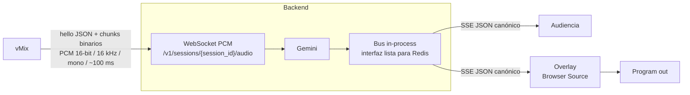
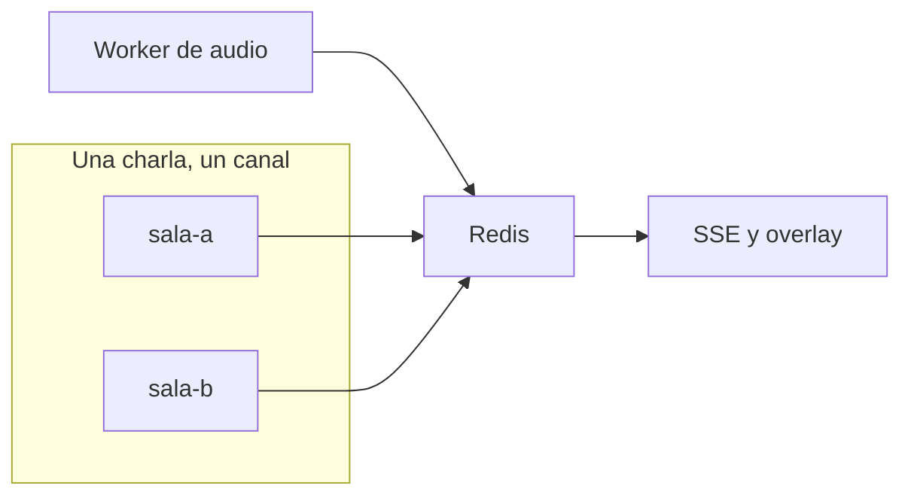

# Genesis Subtitling

Transcripción y traducción en vivo para Nerdearla. El audio sale de vMix, el backend lo pasa por Gemini, y los subtítulos se queman en el program out mediante un Browser Source.

## Arquitectura



El JSON de salida lleva `session_id`, `seq`, tiempos, idiomas, `text` e `is_final`. El quemado ocurre en el program out: el player del espectador no incrusta los subtítulos.

## Levantar el servidor

Stack: FastAPI + uvicorn. Gemini Live (`GEMINI_MODEL`, por defecto `gemini-3.5-live-translate-preview`) traduce el PCM al idioma de `--target`. El subtítulo es esa traducción. El audio traducido no se reproduce.

Copiá `.env.example` a `.env` y completá `GEMINI_API_KEY`. Para ver latencia, tokens y cortes de cada sala, completá también `LANGFUSE_PUBLIC_KEY`, `LANGFUSE_SECRET_KEY` y `LANGFUSE_BASE_URL`. Si esas claves quedan vacías, la traducción corre igual. El costo en Langfuse sale de los tokens que devuelve Gemini, no de un precio cargado acá.

Después, en una terminal, con el virtualenv del proyecto (no el Python de Anaconda):

```bash
python3 -m venv .venv
source .venv/bin/activate
pip install -e ".[dev]"
uvicorn genesis.main:app --reload
```

El prompt tiene que mostrar `(.venv)`. Cuando aparezca `Application startup complete`, el servidor queda en `http://127.0.0.1:8000`. Dejá esa terminal abierta.

- Ingest: `WS /v1/sessions/{session_id}/audio`
- Salida: `GET /v1/sessions/{session_id}/subtitles`
- Overlay para vMix: `http://127.0.0.1:8000/overlay?session_id=sala-1`

El overlay va abajo, centrado, a dos líneas como máximo, fondo transparente y pastilla negra. Un parcial se ve más tenue que un final. Muestra el campo `text`.

## Probar la traducción

En otra terminal, con el mismo virtualenv y el overlay abierto:

```bash
source .venv/bin/activate
python scripts/send_wav.py samples/tu-audio.wav --source en --target es
```

`--source` es el idioma que se habla en el audio. `--target` es el idioma de los subtítulos. Los códigos son BCP-47 cortos, por ejemplo `es`, `en`, `pt-BR`.

Inglés a español:

```bash
python scripts/send_wav.py samples/tu-audio.wav --source en --target es
```

Español a inglés:

```bash
python scripts/send_wav.py samples/tu-audio.wav --source es --target en
```

El script acepta PCM 16-bit, mono o estéreo, y lo lleva a 16 kHz mono antes de enviarlo. La sesión por defecto es `sala-1`; tiene que coincidir con la del overlay.

## Trazabilidad con Langfuse

Cada sala es una traza `traduccion`, agrupada por `session_id`. Los chunks de PCM no se envían.

Dentro de la traza hay dos tipos de evento:

- `subtitulo-final`: el texto traducido, los idiomas, `latency_ms` desde que empezó la frase y `seq`.
- `uso-api`: los tokens `input` y `output` que Gemini devolvió en `usage_metadata` al cerrar la sala. Langfuse calcula el costo con la tarifa de ese modelo. Si el modelo no está en el catálogo de Langfuse, se ven los tokens y el importe queda vacío hasta darlo de alta ahí.

Si Gemini no conecta o la sesión se cae, la traza queda en error y, si ya había uso, igual se manda `uso-api`. Si faltan las claves o Langfuse no responde, la traducción sigue.

## Salas en simultáneo

Un solo proceso de `uvicorn` puede traducir varias charlas a la vez. Cada una es un `session_id` con su conexión a Gemini, su idioma de destino y sus suscriptores. El bus en memoria entrega cada subtítulo solo a esa sala.

Sala A, inglés a español:

```bash
python scripts/send_wav.py samples/audio-a.wav --session sala-a --source en --target es
```

Overlay: `http://127.0.0.1:8000/overlay?session_id=sala-a`

Sala B, en paralelo:

```bash
python scripts/send_wav.py samples/audio-b.wav --session sala-b --source es --target en
```

Overlay: `http://127.0.0.1:8000/overlay?session_id=sala-b`

Dos audios con el mismo `session_id` comparten la conexión de Gemini y se pisan. El aislamiento existe entre salas, no dentro de una.

Hoy ese aislamiento vive en la memoria del proceso. Si el proceso se reinicia, las salas se pierden. El ingest y el overlay tienen que pegarle a la misma instancia.

## Conectar vMix

El subtítulo se quema en el program out con una entrada de navegador. El audio en vivo de vMix no entra solo: hay que mandarlo al WebSocket de la misma sala.

### 1. Levantar Genesis en la máquina de vMix

En la computadora donde corre vMix:

```bash
source .venv/bin/activate
uvicorn genesis.main:app --reload
```

Esperá `Application startup complete`. Si vMix está en otra máquina, usá la IP de Genesis en lugar de `127.0.0.1` en todos los pasos de abajo.

### 2. Poner el video en el program

Dejá en el program la cámara, el archivo o la señal que se está transmitiendo. Esa es la capa de abajo.

### 3. Agregar el overlay

1. En vMix, **Add Input**.
2. Elegí **Web Browser**.
3. En URL pegá `http://127.0.0.1:8000/overlay?session_id=sala-1`.
4. Si la entrada tiene la opción de fondo transparente, activala. La página ya es transparente: solo se dibujan los subtítulos.
5. Aceptá. La entrada nueva queda en el listado, no hace falta mandarla al program como video principal.

### 4. Quemarlo encima del video

1. En la entrada del navegador, hacé clic en el número de overlay (**1**).
2. vMix la compone a pantalla completa sobre lo que esté en el program.
3. En la salida se ve el video y, abajo al centro, los subtítulos. Un parcial se ve más tenue que un final.

El `session_id` de la URL tiene que ser el mismo del audio. Para otra charla, repetí los pasos 3 y 4 con otro id, por ejemplo `sala-2`, y otro número de overlay.

### 5. Mandar el audio de esa sala

vMix no abre este WebSocket por sí mismo. El audio de la sala tiene que llegar a:

`ws://127.0.0.1:8000/v1/sessions/sala-1/audio`

El primer mensaje es texto, con el idioma que se habla y el de los subtítulos:

```json
{"type":"hello","source_lang":"es","target_lang":"en","sample_rate_hz":16000,"channels":1,"sample_format":"s16le"}
```

Después van chunks binarios de PCM 16-bit, 16 kHz, mono, de unos 100 ms (3200 bytes).

Para ver los subtítulos sobre el video antes de tener ese puente, con el overlay ya puesto en vMix:

```bash
python scripts/send_wav.py samples/sample-speech-1m.wav --session sala-1 --source en --target es
```

`--session` tiene que coincidir con `session_id` de la URL del navegador. Cuando el audio del program de vMix se envíe por ese mismo WebSocket, los subtítulos siguen al vivo y el WAV ya no hace falta.

## Evolución hacia Redis

La interfaz `SubtitleBus` queda. Cambia la implementación: de colas en el proceso a Redis, una clave por charla.



1. **Pub/sub por sala.** Cada subtítulo se publica en `genesis:sala:{session_id}`. El SSE se suscribe a ese canal. El proceso que traduce y el que dibuja el overlay ya no comparten memoria.
2. **Cache de la charla.** Un hash `genesis:sala:{session_id}:estado` guarda idiomas, `seq` y el último subtítulo. Un overlay que se reconecta muestra el texto vigente en vez de quedar en blanco hasta la próxima frase.
3. **Un worker por charla.** La traducción de `sala-a` corre en su propia tarea o proceso. Si esa conexión con Gemini se corta, `sala-b` sigue.
4. **Varias instancias.** Más de un backend puede publicar y leer las mismas salas, porque Redis es el punto común. El id de la charla sigue siendo el límite entre una y otra.

